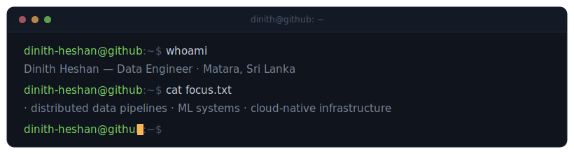

<p align="center">
  
</p>

I build the systems that move, store, and learn from data — Spark pipelines, Kubernetes platforms, and ML systems running in production. Currently an Algorithm Development Engineer at **CodeGen International** and pursuing an **M.Sc. in Big Data Analytics** at Robert Gordon University.

```bash
$ ls ~/current
codegen-international/    # algorithm development · deep learning on NVIDIA Jetson
msc-big-data-analytics/   # cloud computing · data warehousing · big data programming
portfolio/                # → https://dinith-heshan.vercel.app
```

## `$ ls ./projects --featured`

| project | what it is | stack |
|---|---|---|
| **Sentiment Analysis — Hotel Reviews** | NLP over 11,000+ TripAdvisor reviews with ensemble labeling (VADER · BERT · RoBERTa) | `Python` `Scikit-learn` `TF-IDF` `GloVe` |
| **Cloud-Native Gaming Web-Store** | Kubernetes microservices on AWS with blue-green CI/CD and real-time analytics | `Kubernetes` `AWS` `FastAPI` `ClickHouse` |
| **Weather Big Data Pipeline** | Distributed Hadoop/Spark architecture with an MLlib regression pipeline | `Spark` `Hadoop` `Hive` `HDFS` |
| **Vendor Data Warehouse** | Kimball-modeled warehouse with SSIS ETL, CDC, and Azure integration | `SQL` `SSIS` `Azure` |

<sub>Full write-ups on the portfolio → **[dinith-heshan.vercel.app](https://dinith-heshan.vercel.app)**</sub>

## `$ cat skills.json | jq`

```jsonc
{
  "languages":        ["Python", "SQL", "C++", "Bash", "MATLAB", "Java", "R"],
  "data_engineering": ["Spark", "Hadoop", "Hive", "ClickHouse", "PostgreSQL", "SSIS", "ETL/ELT"],
  "ml_and_analytics": ["Scikit-learn", "TensorFlow/Keras", "Spark MLlib", "NLP"],
  "cloud_and_devops": ["AWS", "Azure", "Docker", "Kubernetes", "GitHub Actions", "Prometheus", "Grafana"]
}
```

## `$ git log --stat`

<p align="center">
  
  
</p>

## `$ ping dinith`

[](mailto:dinithheshansp@gmail.com)
[](https://linkedin.com/in/dinith-heshan)
[](https://dinith-heshan.vercel.app)
